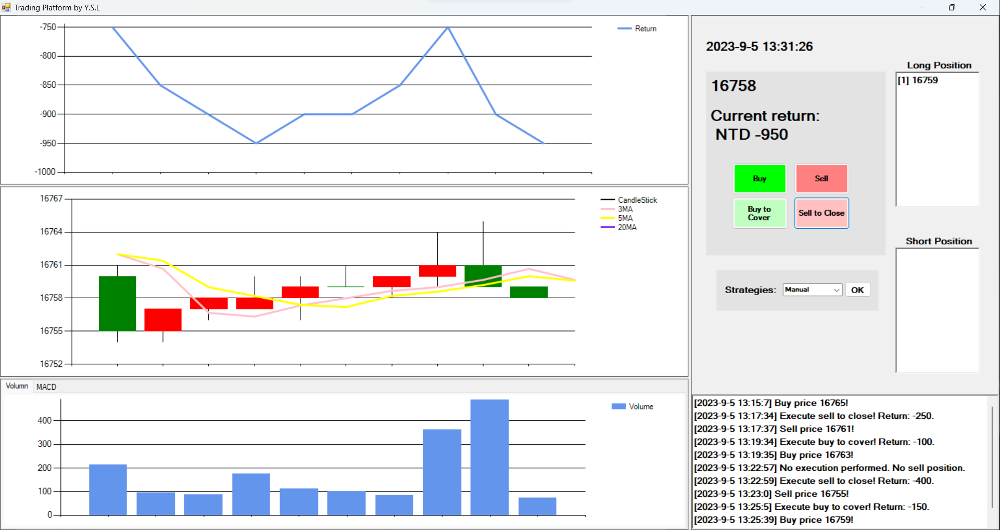
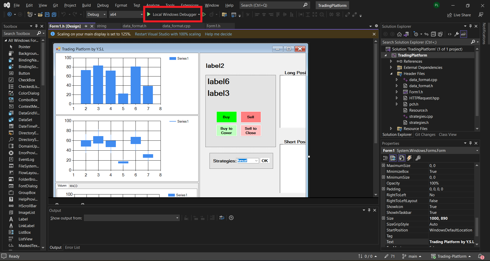

# Trading-Platform



# Prerequisite

# Run the platform
### Step 1
To initialize realtime market data from XQ, run the commands:

```
cd api
python xq.py
```


### Step 2
Duble click `TradingPlatform/TradingPlatform.sln` to start the VS project.

Build project with "Local Windows Debugger". 

